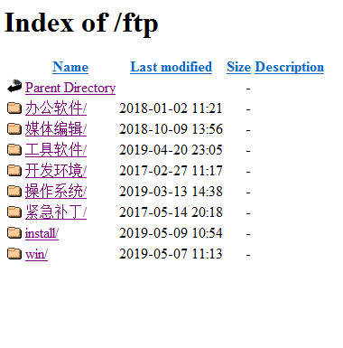

[NEEPU-RESOURES](#font-face华文新魏neepufont-font-facetempus-sans-itcresouresfont)    
- [一.校园@edu邮箱](#一校园edu邮箱)        
  - [1. 激活方法](#1-激活方法)            
    - [1.1 JetBrains的Ultimate版学生免费](#11-jetbrains的ultimate版学生免费)   
    - [1.2 GitHub教育包](#12-github教育包)           
     - [1.3 腾讯云学生计划](#13-腾讯云学生计划)           
      - [1.4 苹果教育优惠](#14-苹果教育优惠)            
      - [1.5 微软教育优惠](#15-微软教育优惠)            
      - [1.6 亚马逊云优惠](#16-亚马逊云优惠)            
      
- [二.知网校园账号](#二知网校园账号)
- [三.图书馆资源](#三图书馆资源)           
   - [3.1 新东方媒体资源库](#31-新东方媒体资源库)           
    - [3.2 东北电力大学图书检索小程序](#32-东北电力大学图书检索小程序)            
    - [3.3 其他资源库](#33-其他资源库)    
- [四.东电FTP服务器](#四东电ftp服务器)
#  NEEPU-RESOURES
**东北电力大学校园资源（<u>整理不易，请右上角Star支持一下:kissing_smiling_eyes:</u>）**

!

##  一.校园@edu邮箱

其实学校给我们每人提供了一个@edu的校园邮箱，只是很多人没有激活

激活之后的邮箱账号为 <u>个人学号@neepu.edu.cn</u>

校园邮箱的作用非常大！！！

总结的话，请移步知乎<u>Yvon Shong</u>的回答[如何赚回学费！高校edu邮箱完整使用方式！](https://zhuanlan.zhihu.com/p/22804091)

(整理不易，请点赞支持！)

以下介绍几种

### 1. 激活方法

登录 [东北电力大学——数字校园信息门户](http://i.neepu.edu.cn:8080/PassPortWeb/login_dd.aspx) （点击进入）

点击上方导航栏的邮件系统即可激活

**注意**：请记好设置的密码。因为在信息平台登录不需要密码，但是在邮箱大师等外部软件登录时是需要的

#### 1.1 JetBrains的Ultimate版学生免费

JetBrains的idea（java编程）、pycharm（python编程）、Webstorm（前端）等编程软件，是业界应用极广，功能强大的软件。而且JetBrains又是一家良心公司，为学生提供一年（到期可以继续申请）、教师终身的Ultimate（即完整版）使用权限

[学生激活网址https://www.jetbrains.com/student/](https://www.jetbrains.com/student/)（点击进入）

注意：激活前最好用校园邮箱账号注册一个Jetbrains的的账号

进入后点击Apply Now即可进入激活页面

提供的认证方式包括校园邮箱及上传学生证等

大概一到两个工作日就会给你的注册邮箱发送确认邮件

这时候在页面输入账号密码即可

#### 1.2 GitHub教育包

[https://education.github.com/pack](https://education.github.com/pack)

GitHub 的账户分为基本账户和高级账户

两者最明显的区别就是基本账户无法新建私人仓库

也就是所有的源代码必须被公开。

而此项免费工具包提供的 GitHub 高级账户

可以新建无限量的私人仓库

首次激活时长为 2 年

如果之后仍然是在校学生，可以免费续期直到毕业。

#### 1.3 腾讯云学生计划

[https://cloud.tencent.com/act/campus](https://cloud.tencent.com/act/campus)

#### 1.4 苹果教育优惠

[https://www.apple.com/cn-k12/shop](https://www.apple.com/cn-k12/shop)

#### 1.5 微软教育优惠

[https://www.microsoftstore.com.cn/student](https://www.microsoftstore.com.cn/student)

#### 1.6 亚马逊云优惠

[https://aws.amazon.com/cn/free](https://aws.amazon.com/cn/free/?all-free-tier.sort-by=item.additionalFields.SortRank&all-free-tier.sort-order=asc&awsf.Free%20Tier%20Types=categories%23featured)

认证方式：校园邮箱

AWS 是亚马逊云服务的简称，它也是全世界最出色的云服务之一。亚马逊的 EC2 主机和 S3 可拓展储存被大量的互联网公司使用，其中就包括 GitHub。

如果你之前对 AWS 有所了解，你或许知道 AWS 针对新用户提供了 1 年期的[免费套餐](https://aws.amazon.com/cn/free/?all-free-tier.sort-by=item.additionalFields.SortRank&all-free-tier.sort-order=asc&awsf.Free%20Tier%20Types=categories%23featured)，这里面包括一台基础版本的 Amazon EC2 云主机。但是，这台云主机有每月 15 GB 的流量限制，超出这个限制就会自动扣费。免费工具包中提供的 $75-$150 信用额度可以抵消掉这笔费用以及其他的费用。下面，就一步一步带你申请这笔信用额度。

首先，在 GitHub 学生开发工具包页面找到 AWS Educate 一项，点击唯一的 unique link 进入如下所示的 AWS Educate 申请页面。

**注意**
Email 地址。这里必须填写你的 @xxx.edu.cn 校园邮箱，不然无法通过。

AWS Account ID。填写此对话框前，你需要提前到 AWS 使用任意邮箱注册一个有效账号。注意，这里不是填写你的 AWS 注册邮箱，而是到账户「设置页面」找到自己对于的 12 位数字 ID。

Promo 兑换码。这一项再通过 unique link 跳转过来时会自动填好，如果为空，则无法获得信用额度。你可以重新回到 GitHub 页面，点击唯一链接跳转。

填写完表单，AWS 会验证你的校园邮箱。

验证完毕之后，你的校园邮箱会收到一封标题为「AWS Educate Application Approved」的信用额度批准邮件，里面会有信用额度的兑换码。

此邮件内容较多，你需要仔细阅读才能找到包含信用额度兑换码的 Credit Code 字段

到目前为止，就差最后一步了。你需要登陆你提前注册好的的 AWS 账号。

在控制面板左侧找到「服务抵扣金额」一项，输入兑换码即可完成信用额度注入。

虽然，GitHub 上面写着，这项信用额度会在 $75-$150 之间，但是我申请后直接给了 $150 的最大额度。

AWS 的信用额度是实打实的真金白银，所以申请过程稍微繁琐。当然，如果你正在使用 AWS，我相信你是不会在意过程的。

## 二.知网校园账号

[在校园网下进入知网](http://www.cnki.net/)即可

##  三.图书馆资源

#### 3.1 新东方媒体资源库
校园网下进入[新东方媒体资源库](http://library.koolearn.com/index?t=1497409972000)
或在图书馆首页中文数据库点击链接

<u>**四六级、考研英语数学政治、甚至还有托福雅思、GRE、GMAT**</u>

#### 3.2 东北电力大学图书检索小程序
微信搜索 “东北电力大学图书检索”
是因特雷开发的一个小程序
搜索图书馆馆藏书籍书籍十分方便
在图书馆想找需要的书籍时候，只需要按照条码号找就行
再也不用盲找了

#### 3.3 其他资源库

图书馆还有其他中文、西文、试用等等数据库，查找论文十分方便

## 四.东电FTP服务器

FTP服务器是支持**文件传输协议**的服务器

简单来说，在校园下载**非常快**,而且整理的软件非常有用！！！

校园网下地址栏输入[http://202.198.8.30/](http://202.198.8.30/) 即可进入

如图，虽然软件版本新的少一点

不过考虑到大家的需求,还是可以差不多满足

毕竟不是都对新版本有执念...

简要列出该ftp下的一些资源

[办公软件](http://202.198.8.30/ftp/%e5%8a%9e%e5%85%ac%e8%bd%af%e4%bb%b6/)

- 科大讯飞语音合成
- AdobeReader
- CAJViewer
- CAD2016
- Office2010、2013、2016
- Visio2010、2013/2016

[媒体编辑](http://202.198.8.30/ftp/%e5%aa%92%e4%bd%93%e7%bc%96%e8%be%91/)

- AdobeCS6、CC
- Autodesk
- CDR

[工具软件](http://202.198.8.30/ftp/%e5%b7%a5%e5%85%b7%e8%bd%af%e4%bb%b6/)

- 7-zip
- Filezilla Client、Server（ftp）
- UltraISO（U启制作）
- VMware14（虚拟机）

[开发环境](http://202.198.8.30/ftp/%e5%bc%80%e5%8f%91%e7%8e%af%e5%a2%83/)

- Jre
- MySQL
- Oracle
- SQLServer
- VisualStudio

[操作系统](http://202.198.8.30/ftp/%e6%93%8d%e4%bd%9c%e7%b3%bb%e7%bb%9f/)

- CentOS
- Server
- Ubuntu
- Windows7、10

**......**