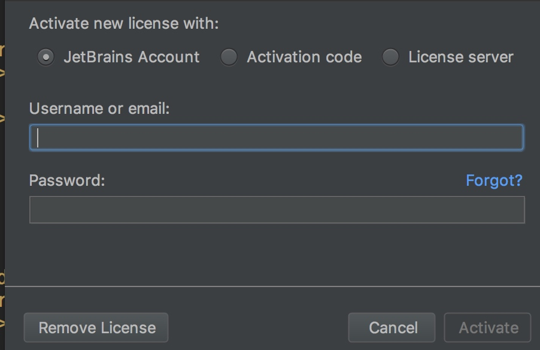

[TOC]

# NEEPU-RESOURES
**东北电力大学校园资源（<u>整理不易，请右上角Star支持一下:kissing_smiling_eyes:</u>）**

## 一.校园@edu邮箱

其实学校给我们每人提供了一个@edu的校园邮箱，只是很多人没有激活
激活之后的邮箱账号为 <u>个人学号@neepu.edu.cn</u>
校园邮箱的作用非常大！！！
总结的话，请移步知乎<u>Yvon Shong</u>的回答[如何赚回学费！高校edu邮箱完整使用方式！](https://zhuanlan.zhihu.com/p/22804091)
(整理不易，请点赞支持！)
以下介绍几种

### 激活方法

登录 [东北电力大学——数字校园信息门户](http://i.neepu.edu.cn:8080/PassPortWeb/login_dd.aspx) （点击进入）
点击上方导航栏的邮件系统即可激活
注意：请记好设置的密码。因为在信息平台登录不需要密码，但是在邮箱大师等外部软件登录时需要

#### 1.JetBrains的Ultimate版学生免费

JetBrains的idea（java编程）、pycharm（python编程）、Webstorm（前端）等编程软件，是业界应用极广，功能强大的软件。而且JetBrains又是一家良心公司，为学生提供一年（到期可以继续申请）、教师终身的Ultimate（即完整版）使用权限

[学生激活网址https://www.jetbrains.com/student/](https://www.jetbrains.com/student/)（点击进入）

注意：激活前最好用校园邮箱账号注册一个Jetbrains的的账号

进入后点击Apply Now即可进入激活页面
提供的认证方式包括校园邮箱及上传学生证等
大概一到两个工作日就会给你的注册邮箱发送确认邮件
这时候在页面输入账号密码即可

#### 3.GitHub教育包

[https://education.github.com/pack](https://education.github.com/pack)

#### 4.腾讯云学生计划

[https://cloud.tencent.com/act/campus](https://cloud.tencent.com/act/campus)

#### 5.苹果教育优惠

[https://www.apple.com/cn-k12/shop](https://www.apple.com/cn-k12/shop)

#### 6.微软教育优惠

[https://www.microsoftstore.com.cn/student](https://www.microsoftstore.com.cn/student)

**......**

## 二.知网校园账号

[在校园网下进入知网](http://www.cnki.net/)即可

## 二.图书馆资源

## 三.东电FTP服务器

FTP服务器是支持**文件传输协议**的服务器

简单来说，在校园下载**非常快**,而且整理的还蛮有用的！！！

校园网下地址栏输入[http://202.198.8.30/](http://202.198.8.30/) 即可进入

如图，虽然软件版本新的少一点

不过考虑到大家的需求,还是可以差不多满足

毕竟不是都对新版本有执念...

简要列出该ftp下的一些资源

[办公软件](http://202.198.8.30/ftp/%e5%8a%9e%e5%85%ac%e8%bd%af%e4%bb%b6/)

- 科大讯飞语音合成
- AdobeReader
- CAJViewer
- CAD2016
- Office2010、2013、2016
- Visio2010、2013/2016

[媒体编辑](http://202.198.8.30/ftp/%e5%aa%92%e4%bd%93%e7%bc%96%e8%be%91/)

- AdobeCS6、CC
- Autodesk
- CDR

[工具软件](http://202.198.8.30/ftp/%e5%b7%a5%e5%85%b7%e8%bd%af%e4%bb%b6/)

- 7-zip
- Filezilla Client、Server（ftp）
- UltraISO（U启制作）
- VMware14（虚拟机）

[开发环境](http://202.198.8.30/ftp/%e5%bc%80%e5%8f%91%e7%8e%af%e5%a2%83/)

- Jre
- MySQL
- Oracle
- SQLServer
- VisualStudio

[操作系统](http://202.198.8.30/ftp/%e6%93%8d%e4%bd%9c%e7%b3%bb%e7%bb%9f/)

- CentOS
- Server
- Ubuntu
- Windows7、10

**......**